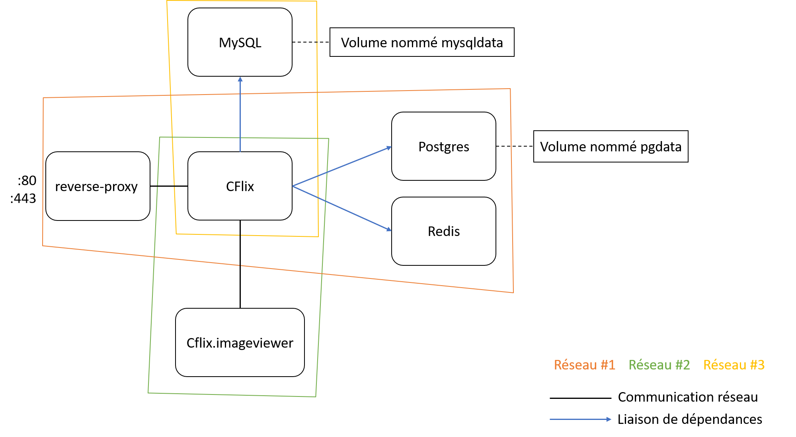

# CFlix - Déploiement

## Description du TP

Il faut compléter les Dockerfiles et le docker-compose.yml afin de respecter le schema suivant :


NB: pour les containers `CFlix` et `CFlix.ImageViewer`, c'est de l'asp .net core 2.0 qu'il faut pour les faire fonctionner !

NB2: il n'y a pas de pièges concernant la composition des Dockerfiles, pour savoir comment les remplir on respecte le dicton : **RTFM !** -> <https://hub.docker.com>

NB3: Pour seed les base de données : `docker exec -it <nom du container cflix> dotnet CFlix.dll database update all`

*Ci dessous se trouve le README original à titre indicatif*

---

## Découpage des projets

La solution a été découpé en 8 containers

- Ceux représentant le site CFlix
  - **CFlix** : le site web principal
  - **CFlix.ImageViewer** : une API utilisé par un des challenges par le container CFlix
  - **Postgres** : BDD principale du projet contenant toutes les informations critiques du projet (login utilisateur, easter egg trouvé, ...)
  - **MySQL** : BDD secondaire contenant toutes les informations du site en rapport avec les épreuves (les séries disponibles et les commentaires). Elle est utilisée pour une des épreuves (SQLi)
  - **Redis** : Permet de pouvoir redémarrer le container CFlix sans perdre les sessions utilisateurs (et peut permettre de scaler les containers frontaux)
- Ceux permettant d'exposer les services web sur l'extérieur
  - **Reverse-proxy** : container nginx exposant CFlix en HTTPS.
- Ceux du hacker Hackonymousoflix
  - **RobotShop** : container représentant le site marchand d'Hackonymousoflix
  - **ShoxxBot** : container simulant l'administrateur du RobotShop

Le fichier `docker-compose.yml` décrit l'orchestration entre ses différents services.

## Paramétrage des projets

En vue de simplifier la réutilisation du projet sur d'autres environnements, un certain nombre de paramètres sont disponibles pour en modifier la configuration.

### Variables d'environnements du container **CFlix**

Les paramètres suivants sont disponibles dans le cas où vous voudriez réutiliser le container CFlix dans un autre contexte.

- Les chaînes de connexions :
  - `CONNECTIONSTRINGS__DEFAULTCONNECTION` - chaîne de connexion à la BDD postgre
  - `CONNECTIONSTRINGS__CFLIXCONNECTION` - chaîne de connexion à la BDD mysql
  - `CONNECTIONSTRINGS__CFLIXROCONNECTION` - chaîne de connexion secondaire à la BDD mysql (/!\ celle-ci doit pointer vers la même machine que la précédente mais avec un compte utilisateur en lecture seule car elle est utilisé pour l'épreuve d'injection SQL)
  - `CONNECTIONSTRINGS__LDAPURL` - chaîne de connexion vers l'active directory ou le LDAP a utilisé
  - `CONNECTIONSTRINGS__REDIS` - chaîne de connexion vers la base Redis (utilisée que pour faire du cache)
  - `CFLIX__IMAGEAPI` - url du service CFlix.ImageViewer utilisé pour l'épreuve LFI
  - `CFLIX__HACKONYMOUSOFLIXDOMAIN` - nom de domaine pointant vers le service hackonymousoflix
- Les paramètres de comportement :
  - `CFLIX__USELDAP` - booléen permettant d'activer ou désactiver l'utilisation du LDAP (voir ci-dessous)
  - `CFLIX__USEREDIS` - booléen permettant d'activer ou désactiver l'utilisation de Redis
  - `CFLIX__STAGE` - 1, 2 ou 3 correspond aux différentes phases disponibles (voir ci-dessous)

### Utilisation du LDAP

Pour le déroulement des épreuves, nous voulions pouvoir identifier les participants. Pour cela, nous avons fait en sorte de se connecter à l'Active Directory de l'entreprise.

Si vous souhaitez également utiliser un LDAP, vous devrez spécifier les variables `CFLIX__USELDAP` et `CONNECTIONSTRINGS__LDAPURL`

### Les Stages

Pour le déroulement du concours, nous avons réparti les épreuves en 3 étapes. Durant la première semaine, 4 épreuves étaient disponibles, puis la seconde 4 de plus et enfin la dernière semaine eut les 4 dernières épreuves.

Cela avait plusieurs objectifs. Le premier étant de répartir les chances des participants en leur permettant de pouvoir rattraper leur retard. Mais cela, nous a aussi permis de mieux communiquer autour du concours et de s'assurer une bonne participation, et donc une meilleure sensibilisation.

Pour reproduire ce comportement, il faudra donc successivement passer la variable `CFLIX__STAGE` de 1 à 3 et faire une mise à jour de la base de donnée `postgre`, pour y insérer les nouvelles épreuves.

NB : Retourner en arrière dans les phases ne désactivera pas les challenges, même en effectuant une nouvelle migration des BDD (Il faudra au préalable supprimer les BDDs pour que ce soit le cas)

## Update database

To update the database with migration and feed it with datas, you can use the following commands :

```bash
dotnet CFlix.dll database update all
# if you want to update them independently :
dotnet CFlix.dll database update mysql
dotnet CFlix.dll database update postgres
```
